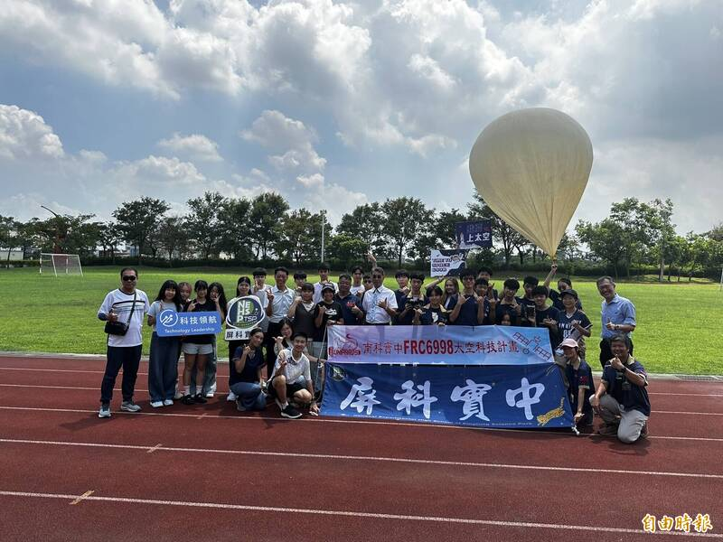

## 高中生自製立方衛星成功升空

2025年9月21日，國立成功大學夏漢民太空科技發展中心（以下簡稱「本中心」）攜手國立南科國際實驗高級中學與屏東實驗高級中學，共同完成一項具指標性的太空教育計畫。兩校學生自主研發的立方衛星，在本中心陳炳志教授團隊的協助下，透過探空氣球順利升空，最高將抵達距地面約30公里的近太空環境，正式展開科學研究任務。

### 計畫背景與目標

本計畫旨在推動太空教育向下扎根，讓高中學生有機會實際參與衛星的設計、製作、測試與升空全流程。透過「做中學」的方式，培養下一代太空人才。

本次任務共有20名高中生參與，他們完整體驗了太空工程的全包流程：從立方衛星的設計、製作、測試到實際升空。衛星搭載感測模組，將蒐集氣壓、溫度、濕度及高空輻射等數據，為學生提供跨領域整合與實作的寶貴經驗。

### 任務特色與創新

陳炳志教授表示，此次計畫的特色在於將衛星製作過程簡化，首次由高中生在專業團隊引導下，完成設計並搭配實際飛行。不同於傳統火箭發射，本次採用探空氣球載具，降低成本與技術門檻，同時點燃年輕世代對太空領域的熱情。

### 人文溫度

其中，南科實中更在立方衛星上懸掛應屆畢業生的祈福卡，期盼學測順利，為本次科學實驗增添了溫暖的人文意涵。

### 校方支持與期許

南科實中校長蔡明輝表示，能讓學生在高中階段親身參與太空科學探索，是難得而深刻的學習經驗。屏科實中校長陳志偉也指出，學校將太空科技納入課程，並期待持續與大學及科研單位攜手合作，拓展學生的科學視野。

### 中心願景與未來規劃

本中心長期致力於推動太空科技發展與教育普及。此次計畫不僅展現大學與高中合作的典範，更為台灣培育下一代科學人才奠定基礎。我們期盼藉由更多跨域合作，持續推動青少年太空教育，開啟屬於台灣的新太空時代。

### 教育意義

此次任務的成功，不僅為臺灣太空教育寫下新頁，更證明了「太空不再遙不可及」的教育理念。夏漢民太空科技中心將持續推動更多太空教育計畫，為臺灣培育更多太空科技人才。
