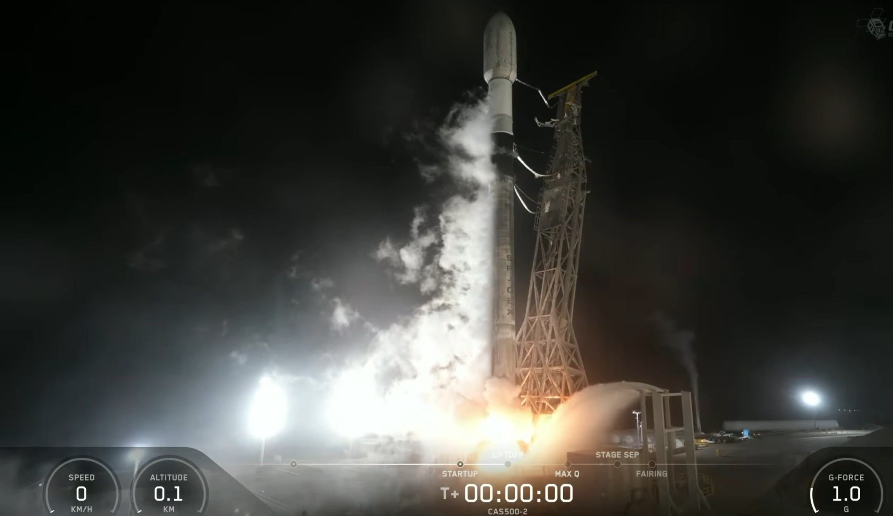
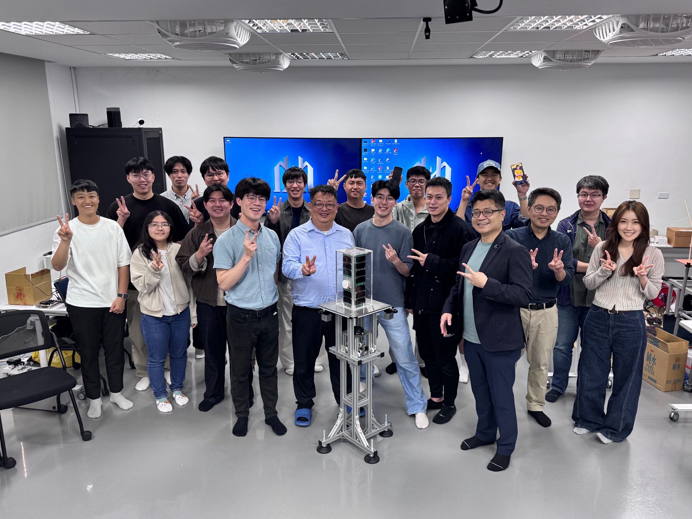
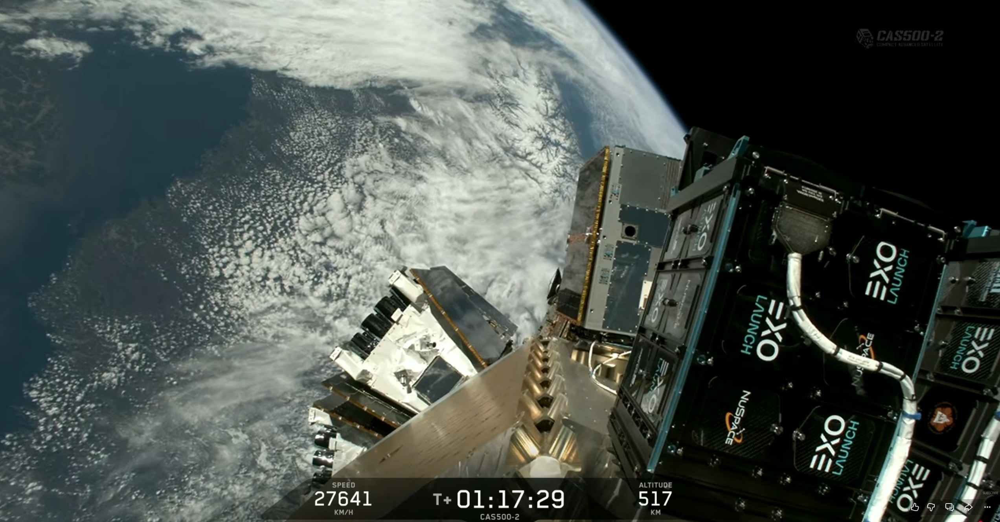
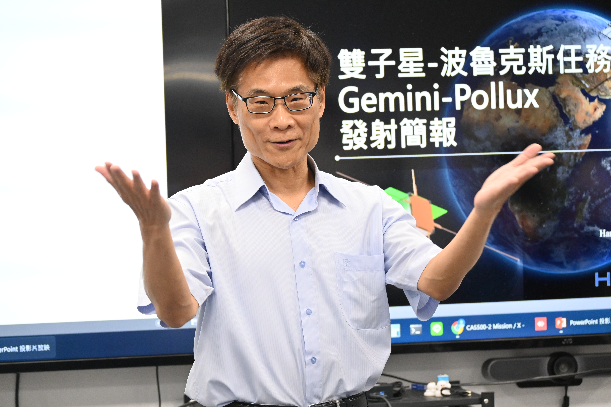
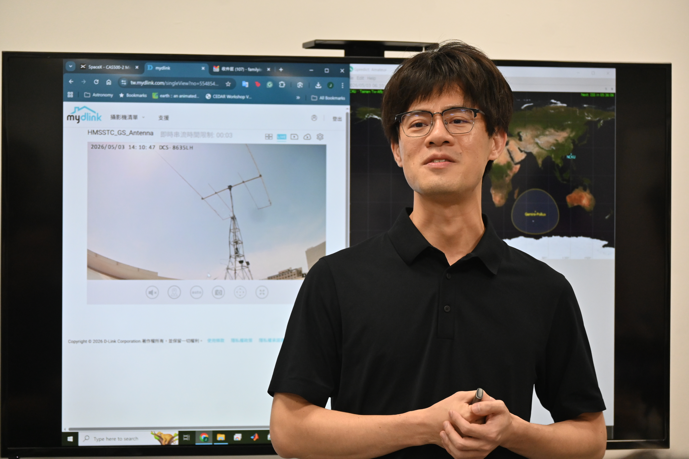
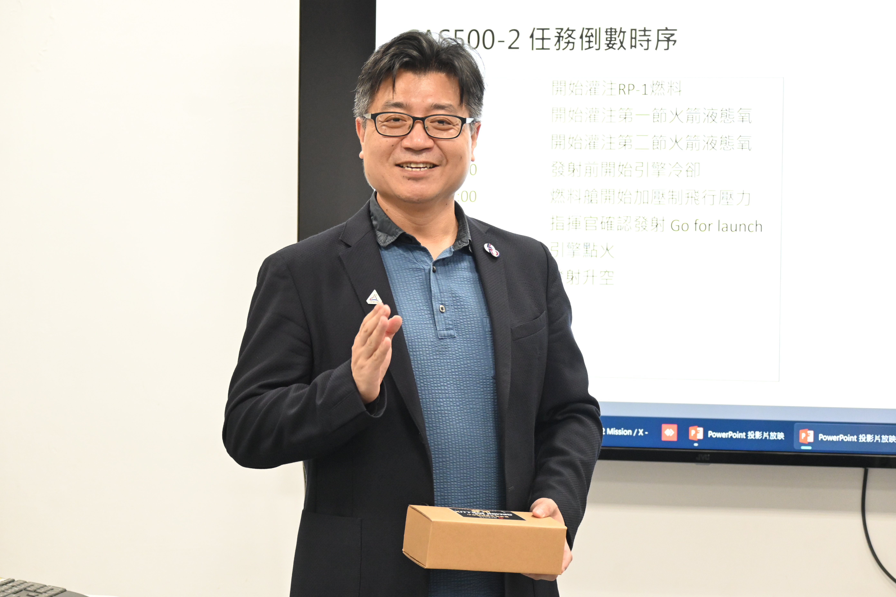
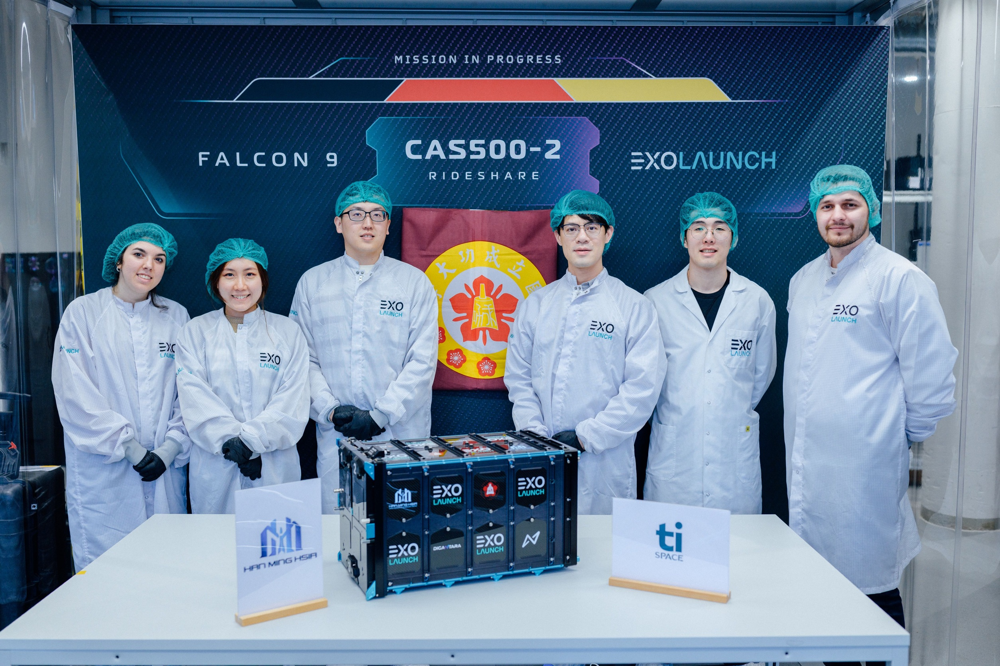
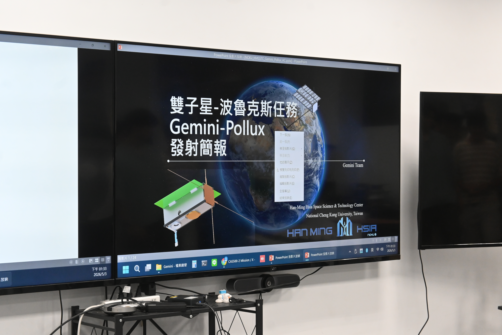

Text and Photos by NCKU News Center & Hsia Han-min Space Technology Center

*The Gemini-Pollux CubeSat was launched today aboard a SpaceX Falcon 9 rocket from Vandenberg Space Force Base in California.*

National Cheng Kung University's (NCKU) Hsia Han-min Space Technology Center (HMSSTC) hosted a live broadcast of its CubeSat mission launch on the afternoon of the 3rd. The "Gemini-Pollux" CubeSat, entirely designed and integrated by NCKU faculty and students—from structural design, power, and communication systems to attitude control and software integration—was successfully launched aboard a SpaceX Falcon 9 rocket from Vandenberg Space Force Base in California. Carrying the hopes of many, it entered a low Earth orbit at an altitude of approximately 590 km, demonstrating the results of Taiwan's space talent cultivation and collaboration with local industries.

*Gemini-Pollux entered space today, carrying the high expectations of the team.*

"The most special part of this CubeSat mission is not just that the satellite is flying into space, but that a group of students, postdoctoral researchers, and faculty from different departments built a system from scratch that can truly operate in space," said Assistant Professor Chia-Ting Lin of the Department of Aeronautics and Astronautics at NCKU. Since 2022, the team has spent over four years on design, development, and pre-launch integration. For the students, this is not only their first participation in a space mission but also the beginning of their space dreams.

*SpaceX Falcon 9 launch livestream screenshot. The NCKU emblem on the Gemini-Pollux deployment pod is clearly visible as it awaits orbit insertion.*

At 2:59 PM Taiwan time on the 3rd, Gemini-Pollux was launched from Vandenberg Space Force Base. It was estimated to enter low Earth orbit at approximately 5:21 PM. Nearly a hundred faculty members and students gathered to watch the launch, focusing intently on the self-built satellite ground station monitoring the launch footage. Seeing the results of over four years of hard work successfully enter space, the satellite will now carry out its mission objectives and assist Taiwan in collecting relevant research data, showing NCKU's contributions to the world.

*NCKU Dean of R&D Chuan-Pu Liu expressed his pride in the team's achievements and thanked the faculty and students during his speech.*

NCKU Dean of R&D Chuan-Pu Liu stated in his speech that he was very pleased to see the results of everyone's hard work and expressed his gratitude to the participating faculty and students for adding an NCKU satellite to space. He emphasized that the Space Technology Center is a highly valued asset of the university, and he hopes to expand NCKU's key research areas to the world. With fierce competition in space technology, he hopes to integrate space-related industries and fields in the future to conduct more experiments in zero-gravity environments.

After entering space, Gemini-Pollux will continue to perform missions beneficial for environmental monitoring, disaster research, space weather observation, and science education. These include observing ionospheric changes, studying the upper atmosphere, taking Earth images, and communicating with the ground via amateur radio equipment. This is the first time a team has not only sent a satellite into space but also strengthened the implementation of ground signal reception and state monitoring, allowing students to deeply participate in subsequent mission operations.

*Assistant Professor Chia-Ting Lin stated that the team put in a lot of effort from design and development to pre-integration since 2022.*

Professor Chia-Ting Lin noted that during the satellite's development, the team completed numerous pre-launch tests, including functional, vibration, and thermal vacuum tests, to ensure the satellite could withstand the vibrations of the rocket launch and the vacuum and temperature changes in space. This meticulous process allowed students to participate in the complex and precise procedures of a real space mission.

*HMSSTC Director Chien-Hung Lin expressed his hope that every student can start by participating in CubeSat missions and eventually participate in national space missions.*

"Science and engineering run in parallel, moving from classroom knowledge to real space missions," said HMSSTC Director Chien-Hung Lin. The center has participated in seven national space missions and aims to provide students with the opportunity to move toward the international stage. The success of today's launch signifies that Taiwan's young space talent is gradually becoming a force in the global space industry.

*The Gemini-Pollux CubeSat was designed and integrated entirely by NCKU faculty and students, including its structure, power, and communication systems.*

This mission also combined several local Taiwanese space industry partners, demonstrating the results of academic and industrial cooperation. The NCKU team collaborated with companies such as Odyssean Space, Jye-Yang Aerospace, and Lead-Inno Technology to develop satellite components, helping the Taiwanese space supply chain gradually take shape through practical missions.

*The HMSSTC team hosted a live broadcast ceremony for the CubeSat mission launch on the afternoon of the 3rd.*

---
Text and Photos by NCKU News Center & Hsia Han-min Space Technology Center
