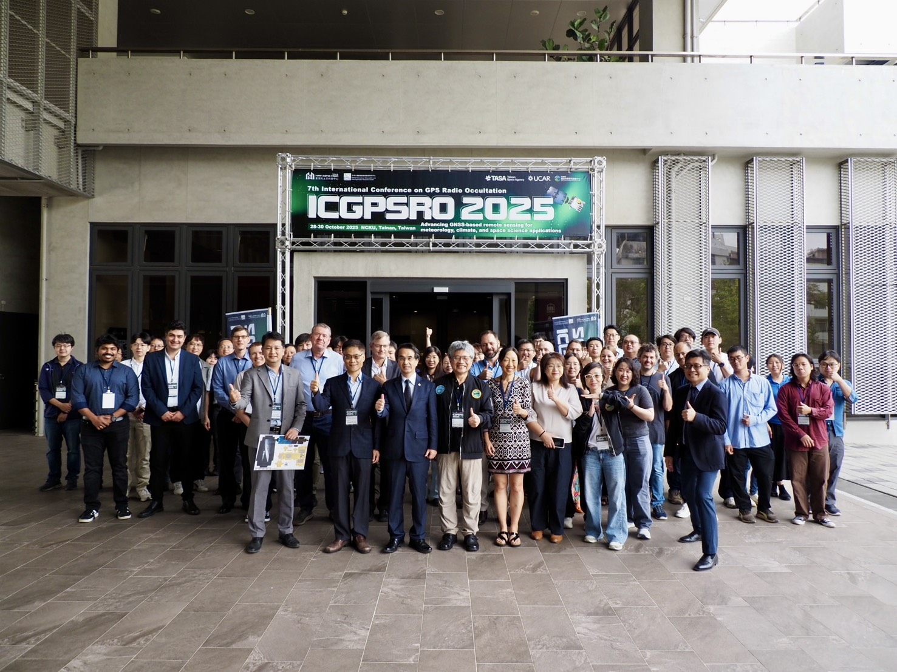
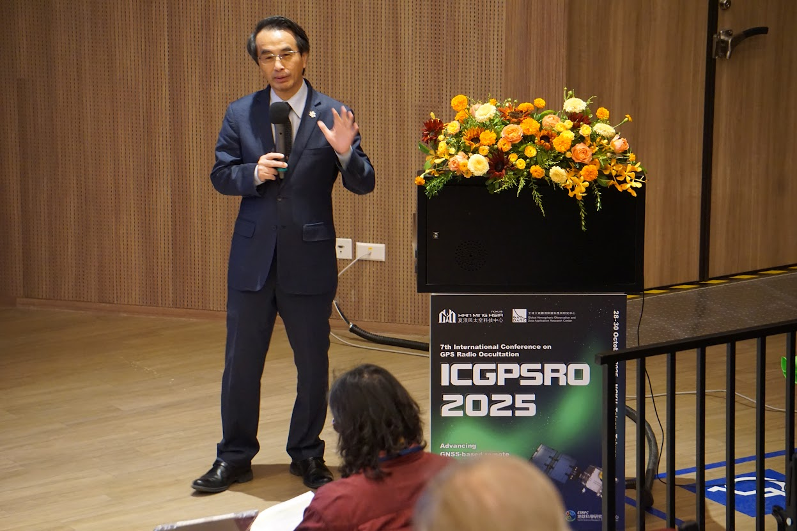
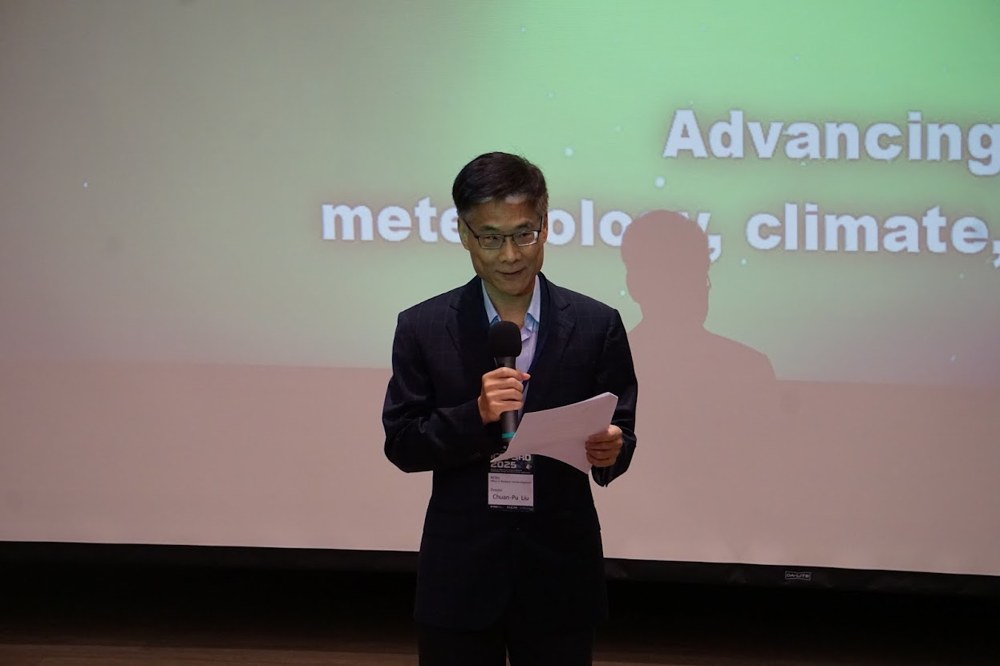
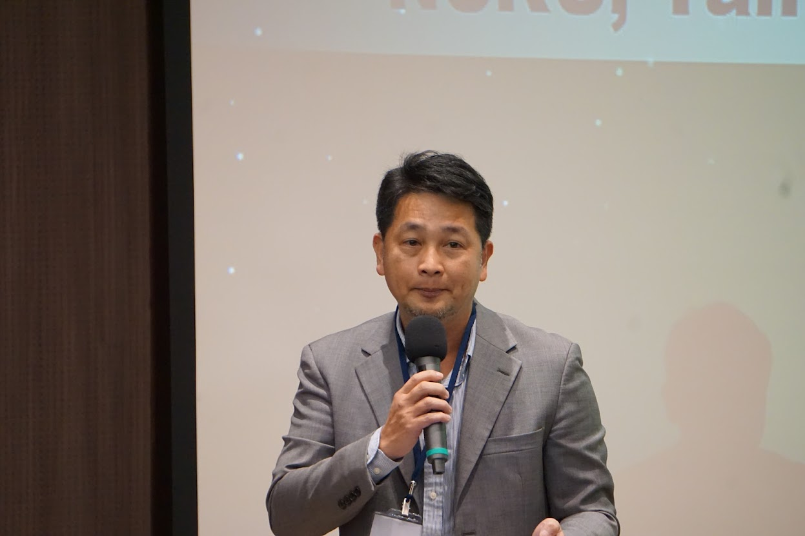
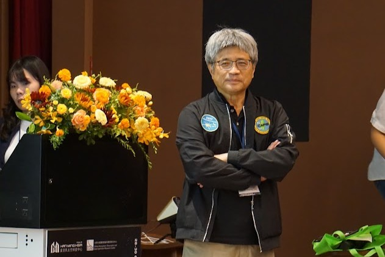

「第七屆國際 GPS 掩星觀測研討會（7th International Conference on GPS Radio Occultation, ICGPSRO）10 月 28 日至 30 日在國立成功大學成功校區旺宏館盛大舉行。來自美、歐、日等頂尖研究機構的專家學者齊聚，探討全球導航衛星系統（GNSS）掩星與反射遙測技術（GNSS-RO/R）於氣象、氣候與太空天氣研究中的最新進展，透過學術對談，將促進全球研究社群對臺灣在掩星觀測與太空天氣研究上的理解與合作，擴大國際科研影響力。

*大合照*

ICGPSRO 為全球 GNSS 掩星與遙測領域的重要國際會議，2025 年由成功大學夏漢民太空科技中心（HMSSTC）、中央大學全球太空觀測與資料處理中心（GAODARC）共同主辦，成大、中央大學、國家太空中心（TASA）及美國大氣科學研究大學聯盟（UCAR）合力策劃，是臺灣少數以太空科學為主題、連結國際學術社群的盛會。

*國家太空中心（TASA）吳宗信主任致詞*

研討會主題涵蓋電離層變化、數值天氣預報資料同化、GNSS-R 海面風場觀測及次世代衛星任務應用等關鍵議題。會中國際太空與大氣科學領域的專家分享 GNSS 遙測技術創新、太空天氣監測資料應用及氣候觀測前瞻發展的最新成果。

*成大研發長劉全璞*

除專題演講與技術論壇外，大會亦設有海報展示與青年學者論壇，提供年輕研究人員與國際專家面對面交流的機會。期望藉由多元互動，培育具備 GNSS 觀測、資料分析與模式應用能力的新世代科研人才，推動我國太空科學持續向前發展。

*成大副國際長張巍勳*

自「福衛三號」與「福衛七號」任務以來，臺灣長期在全球掩星觀測領域扮演關鍵角色，提供全球最多的觀測資料，對氣象預報與太空天氣監測貢獻卓著。

成大團隊在兩項任務中皆扮演核心角色—福衛三號時期即參與電離層資料分析與太空天氣預報模式研發，並於福衛七號任務中率先以掩星觀測揭示南極平流層暖化引發低緯度電離層異常震盪的現象，研究成果刊登於國際頂尖期刊《Geophysical Research Letters》。

*中央大學劉正彥教授*

成大夏漢民太空科技中心近年積極投入衛星研發與太空觀測研究，致力推動跨領域整合與國際合作，逐步建立我國太空科研的重要推動能量。本次會議結合國內太空研究單位與國際專業組織，打造兼具科學探討與技術合作的平台。藉由此此 ICGPSRO 國際研討會，成大持續拓展太空科學的國際影響力，深化臺灣與全球研究機構的合作連結，並推動新一代衛星觀測與太空遙測任務的發展。

---
文、圖／夏漢民太空科技中心
