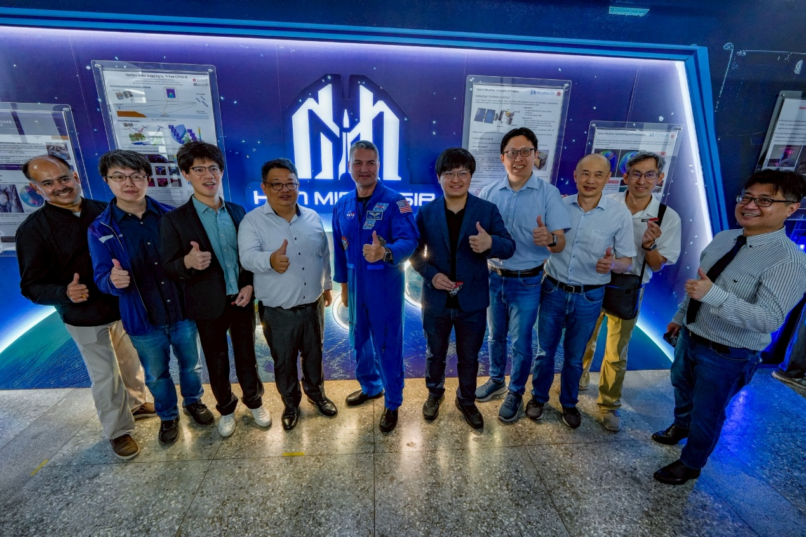
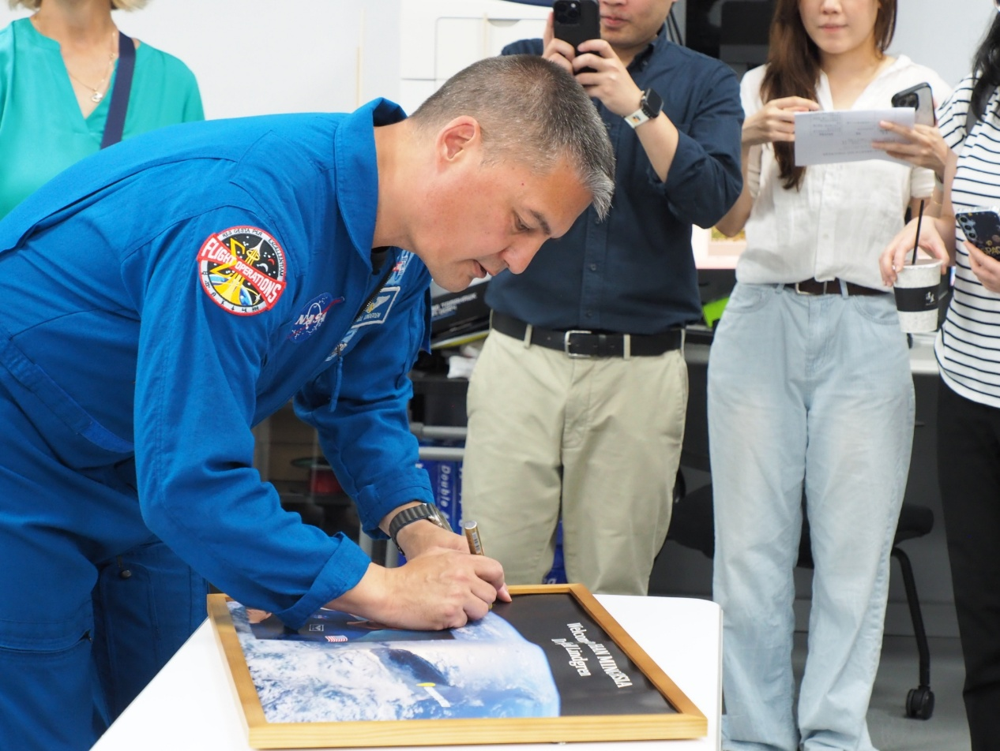
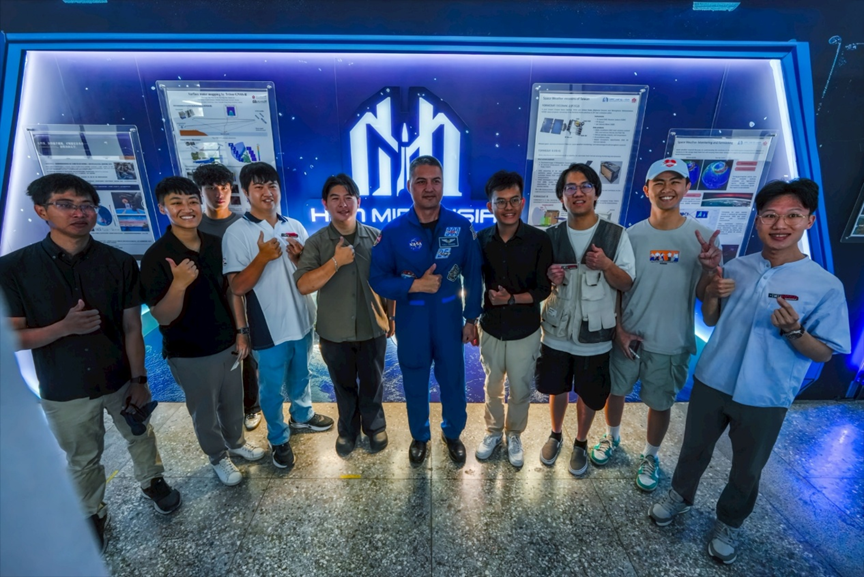
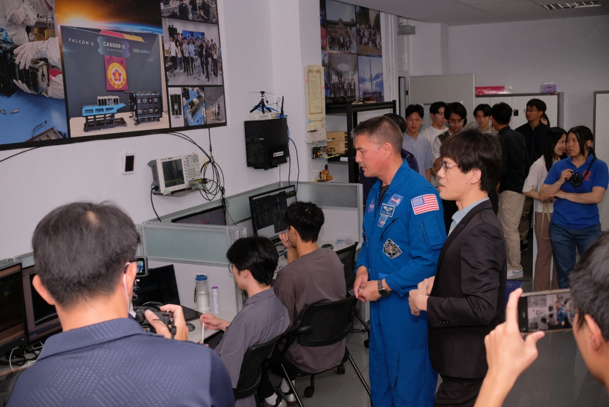
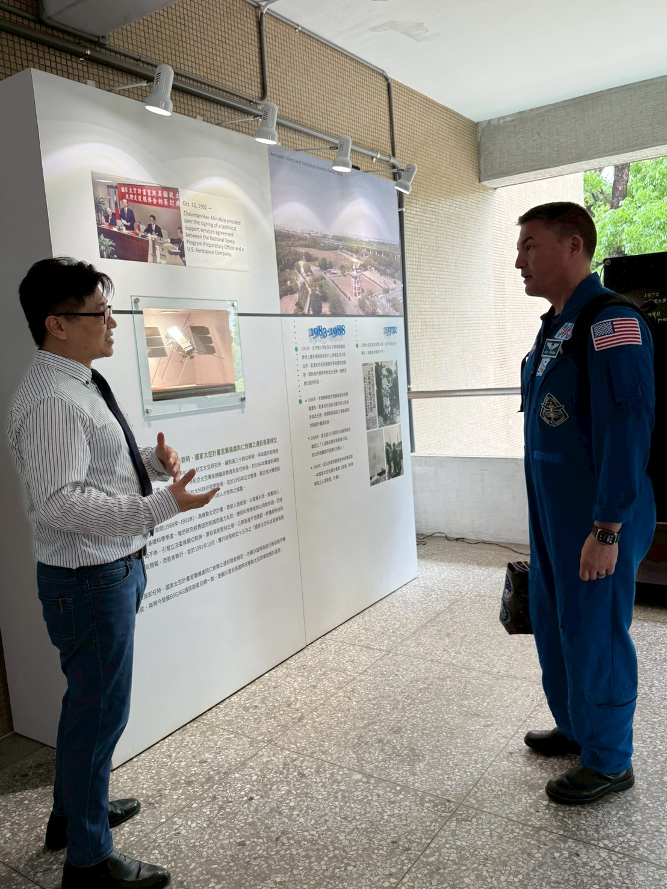
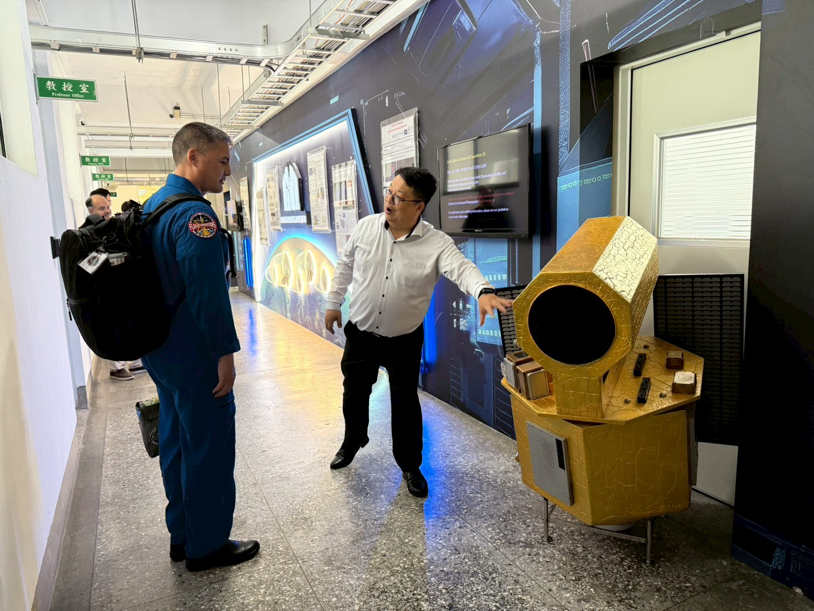
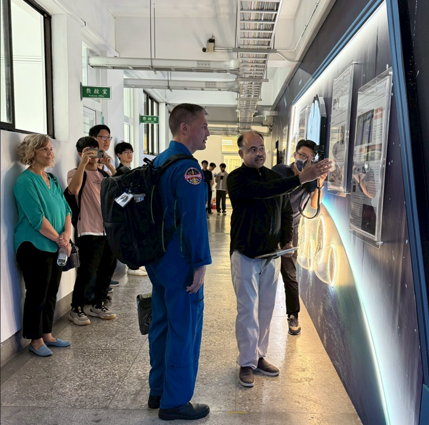
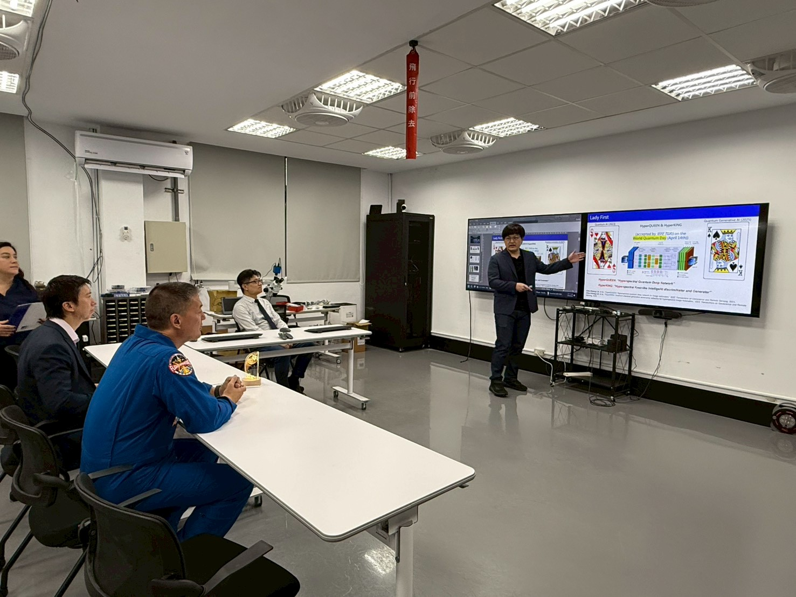
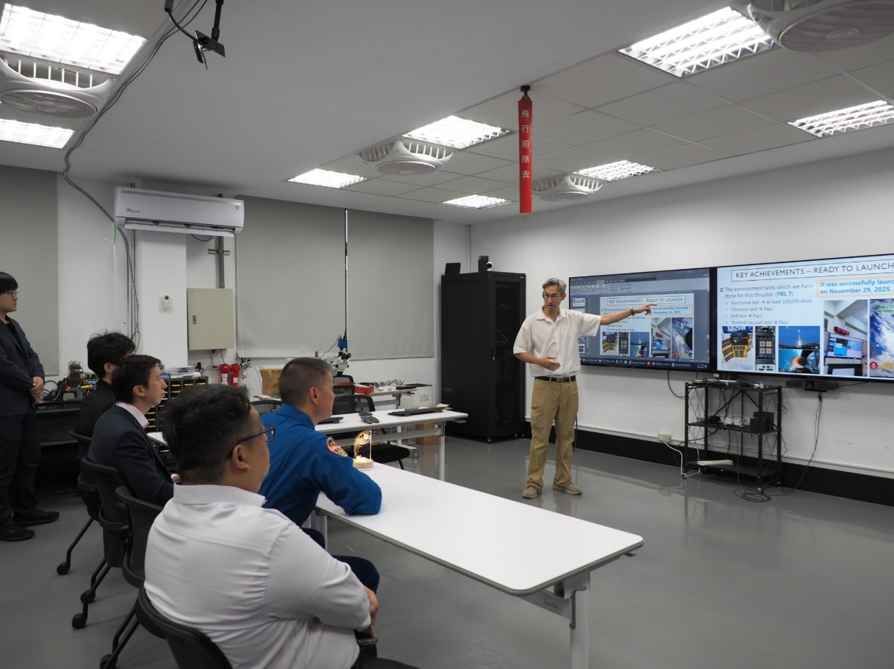
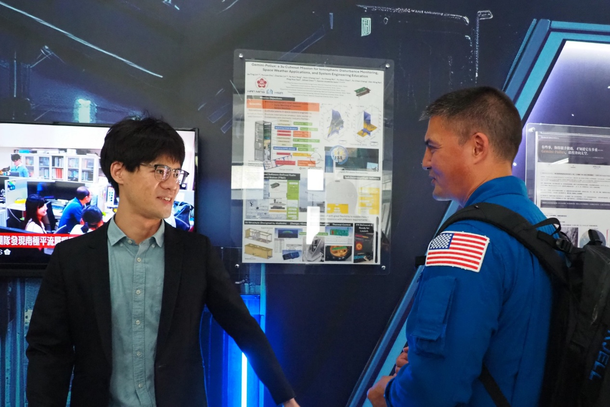

Dr. Kjell Lindgren, the first NASA astronaut with Taiwanese heritage, visited the Hsia Han-min Space Technology Center (HMSSTC) at National Cheng Kung University on April 24 (Friday). He witnessed the NCKU team's successful execution of various national space missions and interacted warmly with students, inspiring the young space generation at NCKU to embrace challenging space missions.

*Center team members (from left to right): Researcher Chieh-Hsi Cha (Dept. of Earth Sciences), Associate Professor Chia-Hung Chen (Dept. of Earth Sciences), Assistant Professor Chia-Ting Lin (Inst. of Space System Engineering), Professor Bing-Chih Chen (Dept. of Physics), Dr. Kjell Lindgren, Professor Chia-Hsiang Lin (Dept. of Electrical Engineering), Dr. Shih-Ping Chen (Dept. of Earth Sciences), Professor Chao-Hung Lin (Dept. of Geomatics), Assistant Professor Tai-Yen Kuo (Dept. of Aeronautics and Astronautics), and Distinguished Professor Jann-Yenq Liu (Center Director and Dept. of Earth Sciences).*

The center was established in 2022 and named after former NCKU President Hsia Han-min, who was entrusted by President Lee Teng-hui to plan Taiwan's space missions. The university-level space technology center integrates the expertise of faculty across the College of Engineering, College of Electrical Engineering and Computer Science, and College of Science to continue driving Taiwan's national space missions. Today, team members shared this sense of mission with Dr. Lindgren and engaged in in-depth discussions regarding the FORMOSAT-2, 3, 6, 7, 8, and 9 space science missions.

Highlights included Professor Bing-Chih Chen sharing observations of high-altitude lightning from FORMOSAT-2, Associate Professor Chia-Hung Chen and Dr. Chieh-Hsi Cha introducing the space weather forecasting system built on FORMOSAT-3 and 7 observations, and Dr. Shih-Ping Chen discussing global hydrological detection using Taiwan's TRITON satellite. Notably, Professor Chia-Hsiang Lin introduced his self-developed AI algorithm that enhances the resolution and spectral bands of FORMOSAT-8 imagery, allowing for finer detail and species identification, which deeply impressed Dr. Lindgren. The NCKU team is heavily involved in the recently launched FORMOSAT-8 mission, collaborating closely with the Taiwan Space Agency (TASA) on automated image processing, resolution enhancement, and space science tasks.

*Dr. Lindgren signing a photo of Taiwan he took from the International Space Station.*

During the visit, Assistant Professor Tai-Yen Kuo introduced NCKU's recent developments in rocket propulsion and space plasma thrusters. Assistant Professor Chia-Ting Lin and 15 students from the Institute of Space System Engineering shared their excitement about a CubeSat scheduled for launch next week, which will be used for natural disaster monitoring and radio communication experiments. Dr. Lindgren showed great care for the students, speaking with each one and presenting them with gifts, providing immense encouragement.

*CubeSat student team with Dr. Kjell Lindgren.*

In terms of talent cultivation, Assistant Professor Chia-Ting Lin demonstrated a CubeSat independently developed by a team of over 30 students, along with related ground control station facilities, showcasing the research and development achievements of HMSSTC. This CubeSat is set to be launched in the United States next week.

*Dr. Lindgren visiting the ground control station.*

A special highlight of the event was Dr. Lindgren signing a photo of Taiwan he captured from the International Space Station, symbolizing the connection between Taiwan and the international space community. He also enthusiastically posed for photos with the CubeSat student team, encouraging them to continue their dedication to the field of space technology.

Dr. Lindgren expressed high praise for HMSSTC's involvement in national missions, international cooperation, and CubeSat development. Moving forward, the Hsia Han-min Space Technology Center will continue to focus on "National Missions, International Cooperation, and CubeSats" to deepen scientific research capabilities and cultivate space technology talent, actively pushing Taiwan onto the international space stage.

### Event Highlights

*Center Director Jann-Yenq Liu introducing the origin of HMSSTC.*

*Professor Bing-Chih Chen introducing the FORMOSAT-2 high-altitude lightning mission.*

*Researcher Chieh-Hsi Cha introducing the space weather forecasting system built on FORMOSAT-3 and 7 observations.*

*Professor Chia-Hsiang Lin introducing AI technology for enhancing FORMOSAT-8 remote sensing image resolution.*

*Assistant Professor Tai-Yen Kuo introducing self-developed propulsion technology.*

*Assistant Professor Chia-Ting Lin introducing the student-made CubeSat.*
