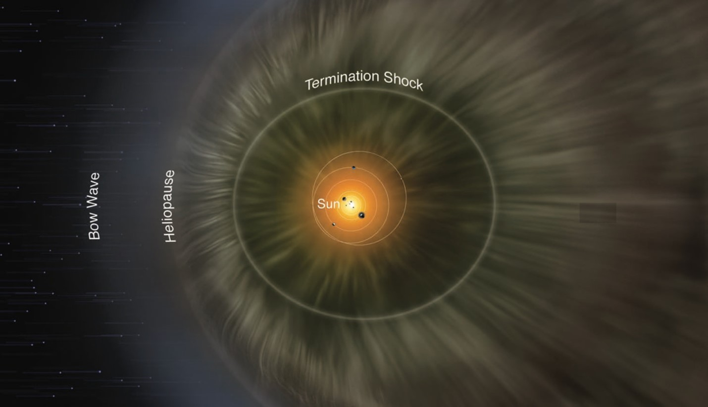
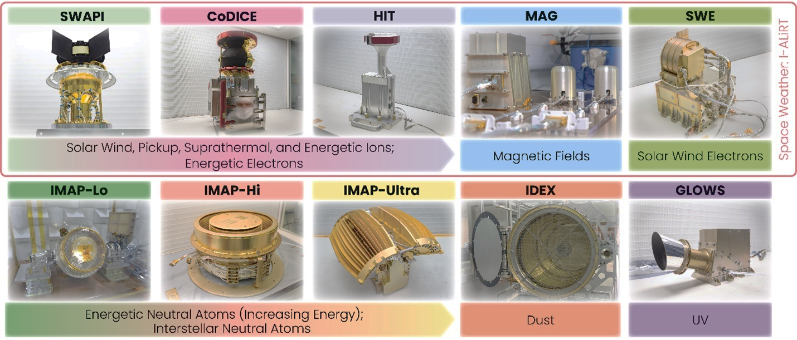
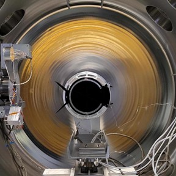
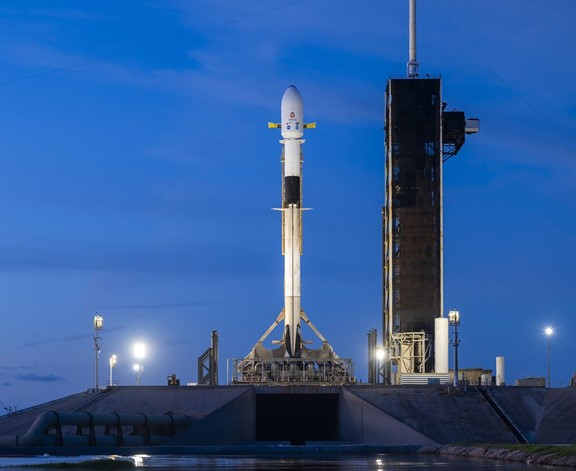

## Congratulations! Dr. Ming-Hsueh Shen Contributed to the Successful NASA IMAP Launch

The solar wind flows outward continuously, forming the heliosphere, a vast protective bubble that shields Earth and other planets from much of the high-energy cosmic radiation in the galaxy. NASA’s IMAP (Interstellar Mapping and Acceleration Probe) mission will further investigate the heliosphere boundary and the interaction between the solar wind and the local interstellar medium.

### Mission Background

Since 2008, NASA’s IBEX mission has mapped the global heliosphere structure using energetic neutral atoms (ENAs) and discovered the well-known IBEX Ribbon. However, IBEX had limitations in energy range and spatial resolution. IMAP succeeds IBEX with higher resolution, broader instrumentation, and faster observation updates to address major open questions in heliophysics.

*Image Credit: NASA/IBEX/Adler Planetarium*

### Four Core Science Objectives

1. Characterize the composition and properties of the Local Interstellar Medium (LISM).
2. Understand the temporal and spatial evolution of the solar wind–interstellar interaction region.
3. Investigate interaction processes between the solar magnetic field and the local interstellar medium.
4. Study particle injection and acceleration near the Sun, within the heliosphere, and in the heliosheath.

These outcomes will help resolve foundational physics questions and improve forecasting of the space environment, which is essential for future deep-space mission safety.

### Launch and Mission Configuration

IMAP launched on September 24, 2025, aboard a SpaceX Falcon 9 from Florida and is heading to the Sun–Earth L1 Lagrange point (about 1.5 million km from Earth). The mission is designed for at least two years of science operations, with potential extension. IMAP carries 10 instruments, including IMAP-Lo, IMAP-Hi, IMAP-Ultra, SWAPI, CoDICE, HIT, SWE, IDEX, MAG, and GLOWS.

*Interstellar Mapping and Acceleration Probe: The NASA IMAP Mission (McComas et al., 2025)*

### Dr. Shen’s Role and Contribution

Dr. Ming-Hsueh Shen, an NCKU alumnus and current Associate Research Scholar at Princeton Space Physics Laboratory, has long worked in space plasma, cosmic dust, energetic particles, and heliospheric physics. In the IMAP mission, he serves as Deputy Lead of the IMAP-Lo instrument and as part of the SWAPI science team (formerly calibration lead), making important contributions to mission science and instrument calibration.

### A Milestone in International Collaboration

This successful launch marks another milestone in international space collaboration and highlights the influence of Taiwanese scientists in global space research. Through the contributions of researchers such as Dr. Shen, Taiwan continues to play an important role in advancing heliophysics and space science.

*Image Source: SpaceX*
